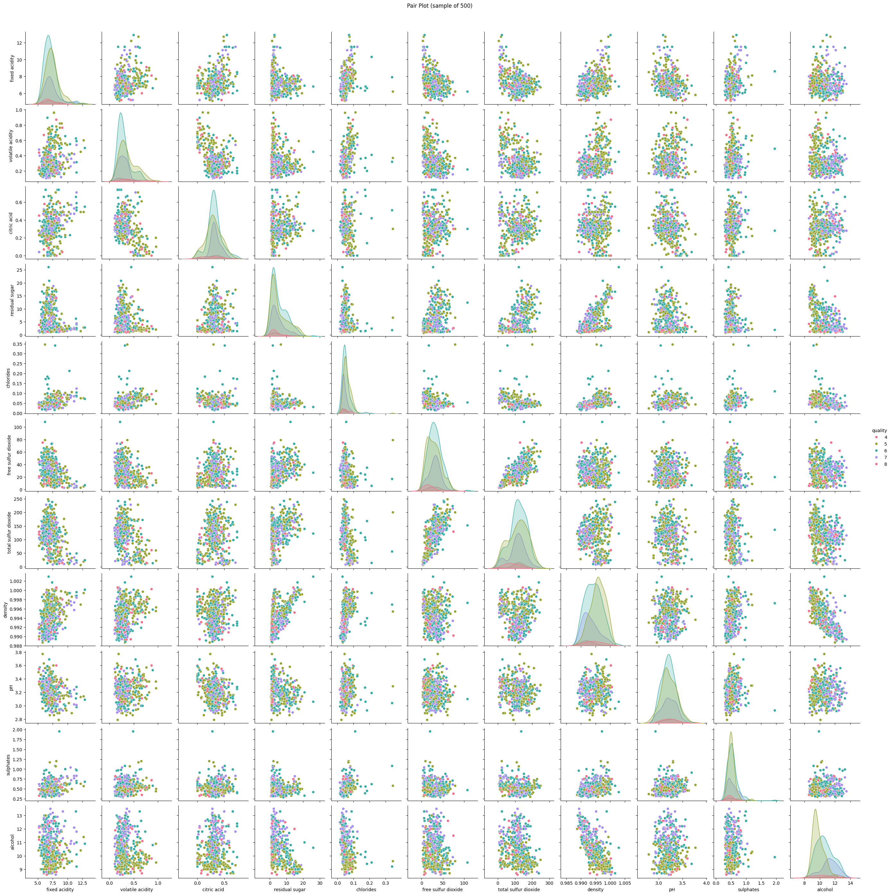
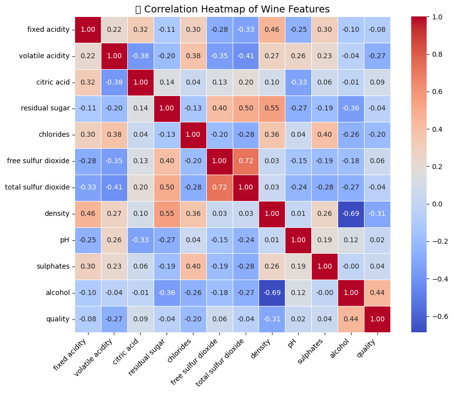
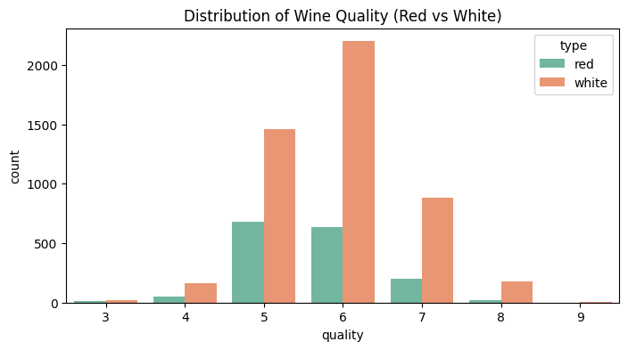
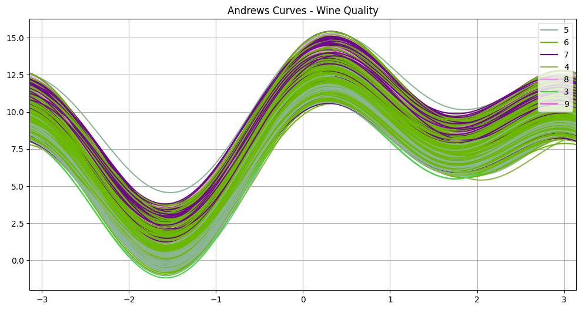
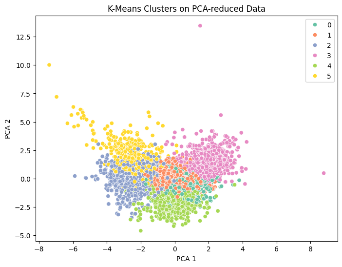

## 🍷 Wine Quality Analysis

This project performs **exploratory data analysis (EDA)** and **multidimensional visualizations** on the UCI Wine Quality dataset (Red & White wines).

## 📊 Features
- Data preprocessing & cleaning
- Statistical summary
- Multivariate analysis:
  - Correlation heatmap
  - Pairplot
  - 3D scatter plot
  - Parallel coordinates
  - Andrews curves
  - Radar chart
  - PCA & KMeans Clustering
 
## 📊 Analysis Visualizations

| 📈 Visualization | 📉 Description |
|------------------|----------------|
|  | **Overview** of the dataset - distribution of key variables. |
|  | **Correlation Heatmap** showing relationships between variables. |
|  | **Gender Distribution** represented in a pie chart. |
|  | **Age Distribution** histogram of the subjects. |
|  | **Income Categories** visualized using a bar chart. |
|  | **Geographic Spread** of data points on a map. |
|  | **Trend Analysis** over time using a line chart. |
|  | **Boxplot** of variable distribution for outlier detection. |
|  | **K-Means Clustering** visualization. |

## 📁 Structure
- `data/`: CSV datasets
- `notebooks/`: Jupyter notebook with full EDA
- `src/`: Python scripts (optional modularization)
- `visuals/`: Saved plots/images

## 🚀 How to Run
1. Clone this repo  
2. Install dependencies:
   ```bash
   pip install -r requirements.txt
